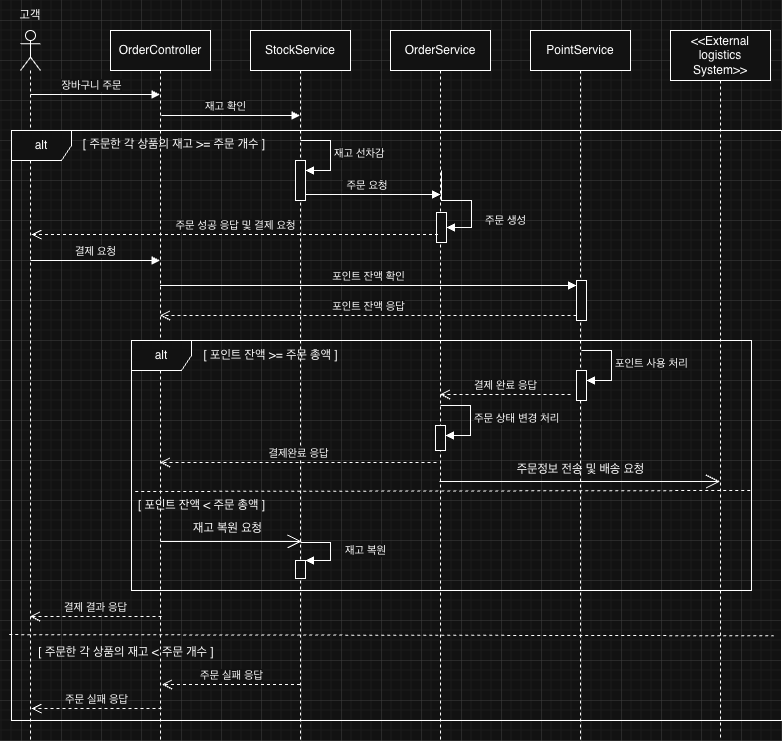

# 🛒 E-Commerce API Specification

> **Version**: 1.0.0 | **Author**: ehkwon

## 1. 개요

이커머스 플랫폼의 RESTful API 명세서입니다. 
7개 도메인(상품, 재고, 유저, 포인트, 장바구니, 주문, 쿠폰, 외부연동)으로 구성되어 있습니다.

**서버 정보**
- 로컬: `http://localhost:8080`
- 운영: `https://api.ecommerce.com`

---

## 2. 도메인별 주요 API

### 2.1 상품 (Product)

#### 상품 목록 조회
`GET /api/product`

**Query Parameters**
- `page`: 페이지 번호 (기본값: 0)
- `size`: 페이지 크기 (기본값: 20)
- `sort`: 정렬 기준 (latest, sales, price_asc, price_desc)
- `category`: 카테고리 필터

#### 상품 상세 조회
`GET /api/product/{productId}`

#### 상품 등록
`POST /api/product`

{
"productName": "상품명",
"category": "카테고리",
"description": "설명",
"imageUrl": "이미지 URL",
"exposeFlag": true
}


#### 인기 상품 조회
`GET /api/product/top?limit=10`

#### 상품 옵션 등록
`POST /api/product/option`

{
"productId": 1,
"optionName": "사이즈-L",
"optionPrice": 12000,
"stockQuantity": 50
}


---

### 2.2 재고 (Stock)

#### 재고 조회
`GET /api/stock/{productOptionId}`

#### 재고 변경
`POST /api/stock/{productOptionId}`

{
"amount": 10,
"updatedBy": 1
}


*amount: 양수(추가), 음수(감소)*

---

### 2.3 유저 (User)

#### 유저 목록 조회
`GET /api/user?role=CUSTOMER`

#### 유저 등록
`POST /api/user`

{
"username": "사용자명",
"role": "CUSTOMER"
}


#### 유저 포인트 조회
`GET /api/user/point/{userId}`

---

### 2.4 포인트 (Point)

#### 포인트 충전
`POST /api/point/charge/{userId}`

{
"amount": 10000.00,
"description": "충전 사유"
}


#### 포인트 사용
`POST /api/point/use/{userId}`

{
"amount": 5000.00,
"orderId": 1,
"description": "주문 결제"
}


#### 포인트 히스토리 조회
`GET /api/point/{userId}?transactionType=CHARGE`

---

### 2.5 장바구니 (Cart)

#### 장바구니 조회
`GET /api/cart/{userId}`

#### 장바구니 추가
`POST /api/cart/{userId}`

{
"productOptionId": 1,
"quantity": 2
}


#### 장바구니 수정
`PATCH /api/cart/{cartId}`

#### 장바구니 삭제
`DELETE /api/cart/{userId}/{productId}`

---

### 2.6 주문 (Order)

#### 주문 생성
`POST /api/order/{userId}`

{
"items": [
{
"productOptionId": 1,
"quantity": 2
}
],
"usedPoints": 5000.00,
"couponId": 1
}


#### 주문 목록 조회
`GET /api/order/{userId}?status=PAID`

#### 주문 상세 조회
`GET /api/order/detail/{orderId}`

#### 주문 상태 변경
`PATCH /api/order/status/{userId}`

{
"orderId": 1,
"orderStatus": "PAID"
}


*주문 상태: PENDING, PAID, CANCELLED*

#### 주문 항목 상태 변경
`PATCH /api/order/orderItem/status/{orderItemId}`

{
"itemStatus": "SHIPPING"
}


*항목 상태: PREPARING, SHIPPING, DELIVERED, CANCELLED*

#### 결제
`POST /api/order/{orderId}/payment`

{
"paymentMethod": "신용카드",
"usedPoints": 5000.00
}


---

### 2.7 쿠폰 (Coupon)

#### 쿠폰 생성
`POST /api/coupons`

{
"couponName": "신규가입 쿠폰",
"discountType": "FIXED",
"discountValue": 5000.00,
"minOrderAmount": 30000.00,
"maxIssueCount": 1000,
"validFrom": "2025-11-01T00:00:00",
"validTo": "2025-12-31T23:59:59",
"createdBy": 1
}


*할인 타입: FIXED(정액), PERCENTAGE(정률)*

#### 쿠폰 목록 조회
`GET /api/coupons?discountType=FIXED`

#### 유저 쿠폰 조회
`GET /api/coupons/user/{userId}?isUsed=false`

#### 쿠폰 발행
`POST /api/coupons/user/{userId}/{couponId}`

#### 선착순 쿠폰 발행
`PATCH /api/coupons/{couponId}/issue`

{
"userId": 1
}


---

### 2.8 외부연동 (Integration)

#### 주문 연동 로그 조회
`GET /api/integrations/logs/{orderId}?integrationType=LOGISTICS`

*연동 타입: LOGISTICS, SALES_MANAGEMENT, ERP*

#### 실패 건 재시도
`POST /api/integrations/retry/{logId}`

---

## 3. 주문-결제 프로세스



### 프로세스 흐름

1. 고객 장바구니 주문 (쿠폰 검증은 주문 화면에서 함) → 
2. 재고 확인 → 2-1. 재고 없으면 주문 실패 응답 | 2-2. 재고 있으면 재고 차감 →
3. 주문 생성 → 
4. 결제 요청 → 5-1. 포인트 잔액 부족 시 재고 복원 요청 후 8번으로 | 5-2. 포인트 잔액 있을 경우 포인트 차감 →
6. 주문 상태 업데이트 → 
7. 주문정보 외부전송 및 배송 요청 → 
8. 결제 결과 응답

---

## 4. 에러 코드

```
/**

E-Commerce 시스템 에러 코드
*/
public class ErrorCodes {

// ========== 상품 (P) ==========
public static final String PRODUCT_NOT_FOUND = "P001";
public static final String INSUFFICIENT_STOCK = "P002";
public static final String PRODUCT_NOT_EXPOSED = "P003";
public static final String PRODUCT_OPTION_NOT_FOUND = "P004";
public static final String PRODUCT_OPTION_SOLD_OUT = "P005";
public static final String INVALID_PRODUCT_CATEGORY = "P006";
public static final String PRODUCT_CREATION_FAILED = "P007";

// ========== 재고 (S) ==========
public static final String STOCK_NOT_FOUND = "S001";
public static final String STOCK_QUANTITY_INSUFFICIENT = "S002";
public static final String INVALID_STOCK_AMOUNT = "S003";
public static final String STOCK_UPDATE_UNAUTHORIZED = "S004";
public static final String STOCK_CONCURRENCY_CONFLICT = "S005";

// ========== 유저 (U) ==========
public static final String USER_NOT_FOUND = "U001";
public static final String DUPLICATE_USERNAME = "U002";
public static final String INVALID_USER_ROLE = "U003";
public static final String USER_CREATION_FAILED = "U004";
public static final String USER_AUTHENTICATION_FAILED = "U005";
public static final String USER_AUTHORIZATION_FAILED = "U006";

// ========== 포인트 (PT) ==========
public static final String INSUFFICIENT_POINT_BALANCE = "PT001";
public static final String INVALID_POINT_AMOUNT = "PT002";
public static final String POINT_HISTORY_NOT_FOUND = "PT003";
public static final String POINT_CHARGE_FAILED = "PT004";
public static final String POINT_USE_FAILED = "PT005";
public static final String INVALID_POINT_TRANSACTION_TYPE = "PT006";
public static final String POINT_CONCURRENCY_ERROR = "PT007";

// ========== 장바구니 (C) ==========
public static final String CART_ITEM_NOT_FOUND = "C001";
public static final String CART_EMPTY = "C002";
public static final String INVALID_CART_QUANTITY = "C003";
public static final String CART_ADD_FAILED = "C004";
public static final String CART_UPDATE_FAILED = "C005";
public static final String CART_ITEM_ALREADY_EXISTS = "C006";

// ========== 주문 (O) ==========
public static final String ORDER_NOT_FOUND = "O001";
public static final String ORDER_ITEM_NOT_FOUND = "O002";
public static final String ORDER_CREATION_FAILED = "O003";
public static final String INVALID_ORDER_STATUS = "O004";
public static final String ORDER_CANCEL_NOT_ALLOWED = "O005";
public static final String PAYMENT_FAILED = "O006";
public static final String PAYMENT_AMOUNT_MISMATCH = "O007";
public static final String INVALID_PAYMENT_METHOD = "O008";
public static final String ORDER_ITEMS_EMPTY = "O009";
public static final String ORDER_STATUS_UPDATE_FAILED = "O010";

// ========== 쿠폰 (CP) ==========
public static final String COUPON_NOT_FOUND = "CP001";
public static final String COUPON_EXPIRED = "CP002";
public static final String COUPON_ALREADY_USED = "CP003";
public static final String COUPON_MIN_ORDER_NOT_MET = "CP004";
public static final String COUPON_ISSUE_LIMIT_EXCEEDED = "CP005";
public static final String USER_COUPON_NOT_FOUND = "CP006";
public static final String COUPON_ALREADY_ISSUED = "CP007";
public static final String INVALID_COUPON_DISCOUNT_TYPE = "CP008";
public static final String COUPON_ISSUE_FAILED = "CP009";
public static final String COUPON_ISSUE_RACE_FAILED = "CP010";

// ========== 외부연동 (I) ==========
public static final String INTEGRATION_FAILED = "I001";
public static final String INTEGRATION_LOG_NOT_FOUND = "I002";
public static final String LOGISTICS_INTEGRATION_FAILED = "I003";
public static final String SALES_MANAGEMENT_INTEGRATION_FAILED = "I004";
public static final String ERP_INTEGRATION_FAILED = "I005";
public static final String INTEGRATION_RETRY_FAILED = "I006";
public static final String INTEGRATION_MAX_RETRY_EXCEEDED = "I007";
public static final String INVALID_INTEGRATION_TYPE = "I008";

// ========== 공통 (E) ==========
public static final String BAD_REQUEST = "E001";
public static final String UNAUTHORIZED = "E002";
public static final String FORBIDDEN = "E003";
public static final String NOT_FOUND = "E004";
public static final String INTERNAL_SERVER_ERROR = "E500";
public static final String DATABASE_ERROR = "E501";
public static final String EXTERNAL_API_ERROR = "E502";
public static final String VALIDATION_FAILED = "E503";
public static final String TIMEOUT_ERROR = "E504";
}
```


---

## 5. 공통 응답 형식

### 에러 응답

```
{
"timestamp": "2025-10-31T00:00:00",
"status": 400,
"error": "Bad Request",
"message": "에러 메시지",
"path": "/api/product"
}
```


### HTTP 상태 코드

| 코드 | 설명 |
|------|------|
| 200 | 요청 성공 |
| 201 | 리소스 생성 성공 |
| 204 | 성공 (응답 본문 없음) |
| 400 | 잘못된 요청 |
| 404 | 리소스를 찾을 수 없음 |
| 409 | 충돌 (예: 쿠폰 소진) |
| 500 | 서버 내부 오류 |

---

**문서 작성일**: 2025-10-31 | **버전**: 1.0.0