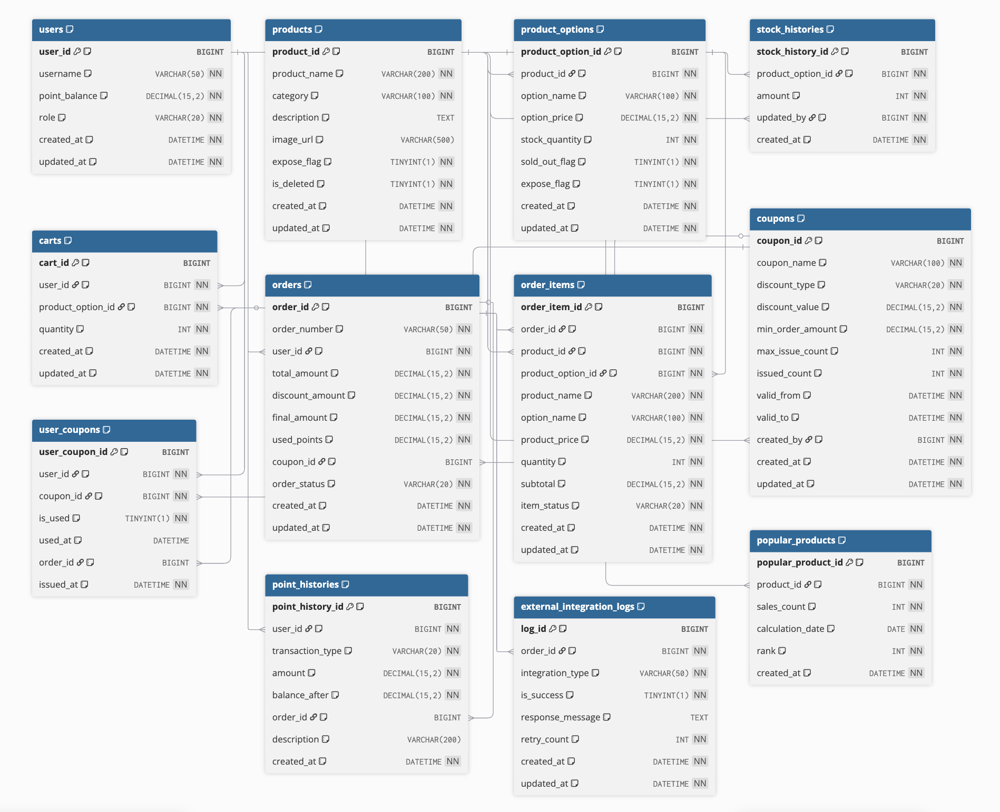

# Data Models

## 문서 정보
- **버전**: 1.0.0
- **작성일**: 2025-10-29
- **프로젝트명**: E-Commerce System
- **기준 문서**: requirements.md v1.0.0

---

## 개요

이 문서는 이커머스 시스템의 데이터 모델과 비즈니스 규칙을 정의합니다. 데이터베이스 스키마는 MySQL을 기반으로 설계되었으며, 상품 옵션 관리, 주문 상태 분리, 포인트 시스템, 외부 연동 로그 기능을 가집니다.

---

## 용어 사전

### 주문 관련 상태

#### order_status (주문 전체 상태)
- **PENDING**: 결제 대기 상태. 주문 생성 직후 재고가 예약된 상태
    - 전환 조건: 주문 생성 API 호출 성공 시
    - 유효 기간: 15분 (타임아웃 시 자동 CANCELLED)
- **PAID**: 결제 완료 상태. 포인트/쿠폰 차감 완료, 재고 확정 차감됨
    - 전환 조건: 결제 API 호출 성공 및 결제 승인 완료
- **CANCELLED**: 주문 취소 상태. 예약 재고 복원, 포인트/쿠폰 환원됨
    - 전환 조건: 고객의 명시적 취소 요청 또는 15분 타임아웃

#### item_status (주문 상품별 배송 상태)
- **PREPARING**: 상품 준비 중. 결제 완료 후 출고 전 단계
    - 전환 조건: 주문 상태가 PAID로 변경 시 자동 설정
- **SHIPPING**: 배송 중. 물류사에 인계 완료
    - 전환 조건: 관리자의 출고 처리 또는 물류 연동 시스템 응답
- **DELIVERED**: 배송 완료. 고객 수령 완료
    - 전환 조건: 물류사의 배송 완료 알림 또는 관리자의 수동 처리
- **CANCELLED**: 개별 상품 취소. 부분 취소 시 사용
    - 전환 조건: PREPARING 상태에서만 가능, 고객 요청 또는 재고 부족

### 재고 관련

- **physicalStock**: 물리적 재고 수량
- **reservedStock**: 예약된 재고 수량
- **availableStock**: 실제 판매 가능 재고 (physicalStock - reservedStock)

#### reservation_status (재고 예약 상태)
- **RESERVED**: 재고 예약 중. 주문 생성 시점부터 15분간 유지
- **CONFIRMED**: 재고 확정. 결제 완료 시 실제 재고에서 차감
- **RELEASED**: 예약 해제. 타임아웃 또는 주문 취소 시 재고 복원

### 금액 관련 용어

- **total_amount**: 주문 상품들의 정가 합계 (할인 전)
- **discount_amount**: 쿠폰으로 인한 할인 금액
- **final_amount**: 고객이 실제 결제해야 할 금액 (total_amount - discount_amount - used_points)
- **used_points**: 결제 시 사용한 포인트 (1포인트 = 1원)

### 플래그 관련 용어

- **expose_flag**: 노출 여부
    - 1: 고객에게 노출 (목록/검색 결과에 표시)
    - 0: 비노출 (관리자만 조회 가능, 고객 화면에서 숨김)
- **sold_out_flag**: 품절 여부
    - 1: 품절 (재고 없음, 주문 불가)
    - 0: 판매 중 (재고 있음, 주문 가능)
- **is_deleted**: 논리 삭제 여부
    - 1: 삭제됨 (DB에 존재하나 모든 API에서 제외)
    - 0: 활성 상태

---

## ERD (Entity Relationship Diagram)

### ERD 다이어그램

### ERD 코드

dbdiagram.io 코드 보기

Table users {
user_id BIGINT [pk, increment, note: '사용자 고유 ID']
username VARCHAR(50) [not null, unique, note: '사용자명']
point_balance DECIMAL(15,2) [not null, default: 0, note: '포인트 잔액']
role VARCHAR(20) [not null, default: 'CUSTOMER', note: '역할: CUSTOMER, ADMIN']
created_at DATETIME [not null, default: `CURRENT_TIMESTAMP`, note: '생성일시']
updated_at DATETIME [not null, default: `CURRENT_TIMESTAMP ON UPDATE CURRENT_TIMESTAMP`, note: '수정일시']

indexes {
username
}
}

Table products {
product_id BIGINT [pk, increment, note: '상품 고유 ID']
product_name VARCHAR(200) [not null, note: '상품명']
category VARCHAR(100) [not null, note: '카테고리']
description TEXT [note: '상품 설명']
image_url VARCHAR(500) [note: '이미지 URL']
expose_flag TINYINT(1) [not null, default: 1, note: '상품목록 노출여부 (1: 노출, 0: 비노출)']
is_deleted TINYINT(1) [not null, default: 0, note: '삭제 여부 (논리 삭제)']
created_at DATETIME [not null, default: `CURRENT_TIMESTAMP`, note: '생성일시']
updated_at DATETIME [not null, default: `CURRENT_TIMESTAMP ON UPDATE CURRENT_TIMESTAMP`, note: '수정일시']

indexes {
category
(expose_flag, is_deleted)
}

note: '상품 기본 정보'
}

Table product_options {
product_option_id BIGINT [pk, increment, note: '상품 옵션 고유 ID']
product_id BIGINT [not null, ref: > products.product_id, note: '상품 ID']
option_name VARCHAR(100) [not null, note: '옵션명 (예: 사이즈-M, 색상-레드)']
option_price DECIMAL(15,2) [not null, note: '옵션 가격 (추가 금액 포함)']
stock_quantity INT [not null, default: 0, note: '재고 수량']
sold_out_flag TINYINT(1) [not null, default: 0, note: '품절 여부 (1: 품절, 0: 판매중)']
expose_flag TINYINT(1) [not null, default: 1, note: '옵션 노출 여부 (1: 노출, 0: 비노출)']
created_at DATETIME [not null, default: `CURRENT_TIMESTAMP`, note: '생성일시']
updated_at DATETIME [not null, default: `CURRENT_TIMESTAMP ON UPDATE CURRENT_TIMESTAMP`, note: '수정일시']

indexes {
product_id
(sold_out_flag, expose_flag)
}

note: '상품 옵션 및 옵션별 재고 관리'
}

Table stock_histories {
stock_history_id BIGINT [pk, increment, note: '재고 이력 고유 ID']
product_option_id BIGINT [not null, ref: > product_options.product_option_id, note: '상품 옵션 ID']
amount INT [not null, note: '수량 (양수: 추가, 음수: 감소)']
updated_by BIGINT [not null, ref: > users.user_id, note: '수정자 ID']
created_at DATETIME [not null, default: `CURRENT_TIMESTAMP`, note: '업데이트 일시']

indexes {
product_option_id
created_at
}

note: '재고 이력 (옵션별)'
}

Table stock_reservations {
stock_reservation_id BIGINT [pk, increment, note: '재고 예약 고유 ID']
product_option_id BIGINT [not null, ref: > product_options.product_option_id, note: '상품 옵션 ID']
order_id BIGINT [not null, ref: > orders.order_id, note: '주문 ID']
reserved_quantity INT [not null, note: '예약 수량']
reservation_status VARCHAR(20) [not null, default: 'RESERVED', note: '예약 상태: RESERVED(예약중), CONFIRMED(확정), RELEASED(해제)']
reserved_at DATETIME [not null, default: `CURRENT_TIMESTAMP`, note: '예약 시각']
expires_at DATETIME [not null, note: '예약 만료 시각 (reserved_at + 15분)']
updated_at DATETIME [not null, default: `CURRENT_TIMESTAMP ON UPDATE CURRENT_TIMESTAMP`, note: '수정일시']

indexes {
order_id
(product_option_id, reservation_status)
expires_at
}

note: '재고 예약 관리 (15분 타임아웃 정책)'
}

Table carts {
cart_id BIGINT [pk, increment, note: '장바구니 고유 ID']
user_id BIGINT [not null, ref: > users.user_id, note: '사용자 ID']
product_option_id BIGINT [not null, ref: > product_options.product_option_id, note: '상품 옵션 ID']
quantity INT [not null, note: '수량']
created_at DATETIME [not null, default: `CURRENT_TIMESTAMP`, note: '생성일시']
updated_at DATETIME [not null, default: `CURRENT_TIMESTAMP ON UPDATE CURRENT_TIMESTAMP`, note: '수정일시']

indexes {
(user_id, product_option_id) [unique]
user_id
}

note: '장바구니'
}

Table orders {
order_id BIGINT [pk, increment, note: '주문 고유 ID']
order_number VARCHAR(50) [not null, unique, note: '주문번호']
user_id BIGINT [not null, ref: > users.user_id, note: '사용자 ID']
total_amount DECIMAL(15,2) [not null, note: '총 상품 금액']
discount_amount DECIMAL(15,2) [not null, default: 0, note: '할인 금액']
final_amount DECIMAL(15,2) [not null, note: '최종 결제 금액']
used_points DECIMAL(15,2) [not null, default: 0, note: '사용한 포인트']
coupon_id BIGINT [ref: > coupons.coupon_id, note: '사용한 쿠폰 ID']
order_status VARCHAR(20) [not null, default: 'PENDING', note: '주문 전체 상태: PENDING(결제대기), PAID(결제완료), CANCELLED(취소)']
created_at DATETIME [not null, default: `CURRENT_TIMESTAMP`, note: '주문일시']
updated_at DATETIME [not null, default: `CURRENT_TIMESTAMP ON UPDATE CURRENT_TIMESTAMP`, note: '수정일시']

indexes {
order_number [unique]
user_id
created_at
order_status
}

note: '주문 (전체 주문 상태 관리)'
}

Table order_items {
order_item_id BIGINT [pk, increment, note: '주문 상품 고유 ID']
order_id BIGINT [not null, ref: > orders.order_id, note: '주문 ID']
product_id BIGINT [not null, ref: > products.product_id, note: '상품 ID']
product_option_id BIGINT [not null, ref: > product_options.product_option_id, note: '상품 옵션 ID']
product_name VARCHAR(200) [not null, note: '주문 시점 상품명']
option_name VARCHAR(100) [not null, note: '주문 시점 옵션명']
product_price DECIMAL(15,2) [not null, note: '주문 시점 옵션 가격']
quantity INT [not null, note: '주문 수량']
subtotal DECIMAL(15,2) [not null, note: '소계 (가격 × 수량)']
item_status VARCHAR(20) [not null, default: 'PREPARING', note: '상품별 상태: PREPARING(상품준비중), SHIPPING(배송중), DELIVERED(배송완료), CANCELLED(취소)']
created_at DATETIME [not null, default: `CURRENT_TIMESTAMP`, note: '생성일시']
updated_at DATETIME [not null, default: `CURRENT_TIMESTAMP ON UPDATE CURRENT_TIMESTAMP`, note: '수정일시']

indexes {
order_id
product_option_id
item_status
}

note: '주문 상품 상세 (개별 상품 상태 관리)'
}

Table coupons {
coupon_id BIGINT [pk, increment, note: '쿠폰 고유 ID']
coupon_name VARCHAR(100) [not null, note: '쿠폰명']
discount_type VARCHAR(20) [not null, note: '할인 타입: FIXED(정액), PERCENTAGE(정률)']
discount_value DECIMAL(15,2) [not null, note: '할인 금액 또는 할인 비율']
min_order_amount DECIMAL(15,2) [not null, default: 0, note: '최소 주문 금액']
max_issue_count INT [not null, note: '최대 발급 수량']
issued_count INT [not null, default: 0, note: '현재 발급된 수량']
valid_from DATETIME [not null, note: '유효기간 시작일']
valid_to DATETIME [not null, note: '유효기간 종료일']
created_by BIGINT [not null, ref: > users.user_id, note: '생성자 ID']
created_at DATETIME [not null, default: `CURRENT_TIMESTAMP`, note: '생성일시']
updated_at DATETIME [not null, default: `CURRENT_TIMESTAMP ON UPDATE CURRENT_TIMESTAMP`, note: '수정일시']

indexes {
(valid_from, valid_to)
created_at
}

note: '쿠폰 마스터'
}

Table user_coupons {
user_coupon_id BIGINT [pk, increment, note: '사용자 쿠폰 고유 ID']
user_id BIGINT [not null, ref: > users.user_id, note: '사용자 ID']
coupon_id BIGINT [not null, ref: > coupons.coupon_id, note: '쿠폰 ID']
is_used TINYINT(1) [not null, default: 0, note: '사용 여부']
used_at DATETIME [note: '사용일시']
order_id BIGINT [ref: > orders.order_id, note: '사용한 주문 ID']
issued_at DATETIME [not null, default: `CURRENT_TIMESTAMP`, note: '발급일시']

indexes {
(user_id, coupon_id) [unique]
user_id
coupon_id
(is_used, issued_at)
}

note: '사용자별 쿠폰 발급 및 사용 이력'
}

Table point_histories {
point_history_id BIGINT [pk, increment, note: '포인트 이력 고유 ID']
user_id BIGINT [not null, ref: > users.user_id, note: '사용자 ID']
transaction_type VARCHAR(20) [not null, note: '거래 타입: CHARGE(충전), USE(사용)']
amount DECIMAL(15,2) [not null, note: '거래 금액']
balance_after DECIMAL(15,2) [not null, note: '거래 후 포인트 잔액']
order_id BIGINT [ref: > orders.order_id, note: '연결된 주문 ID (사용 시)']
description VARCHAR(200) [note: '설명']
created_at DATETIME [not null, default: `CURRENT_TIMESTAMP`, note: '거래일시']

indexes {
user_id
created_at
transaction_type
}

note: '포인트 충전 및 사용 이력'
}

Table external_integration_logs {
log_id BIGINT [pk, increment, note: '로그 고유 ID']
order_id BIGINT [not null, ref: > orders.order_id, note: '주문 ID']
integration_type VARCHAR(50) [not null, note: '연동 시스템 타입: LOGISTICS(물류), SALES_MANAGEMENT(매출관리), ERP 등']
is_success TINYINT(1) [not null, default: 0, note: '성공 여부 (1: 성공, 0: 실패)']
response_message TEXT [note: '응답 메시지 또는 에러 메시지']
retry_count INT [not null, default: 0, note: '재시도 횟수']
created_at DATETIME [not null, default: `CURRENT_TIMESTAMP`, note: '최초 전송 시도 일시']
updated_at DATETIME [not null, default: `CURRENT_TIMESTAMP ON UPDATE CURRENT_TIMESTAMP`, note: '마지막 업데이트 일시']

indexes {
order_id
(integration_type, is_success)
created_at
}

note: '외부 시스템 연동 로그 (물류, 매출관리 등)'
}

Table popular_products {
popular_product_id BIGINT [pk, increment, note: '인기 상품 통계 고유 ID']
product_id BIGINT [not null, ref: > products.product_id, note: '상품 ID']
sales_count INT [not null, default: 0, note: '판매 수량']
calculation_date DATE [not null, note: '집계 기준일']
rank INT [not null, note: '순위']
created_at DATETIME [not null, default: `CURRENT_TIMESTAMP`, note: '생성일시']

indexes {
(calculation_date, rank) [unique]
product_id
calculation_date
}

note: '최근 3일간 인기 상품 통계 (배치로 집계)'
}

## 도메인 모델

### 핵심 도메인

#### 1. 사용자 (User Domain)
사용자 계정 관리와 포인트 잔액을 관리하는 도메인입니다.

**주요 엔티티**:
- `users`: 사용자 기본 정보 및 포인트 잔액
- `point_histories`: 포인트 충전 및 사용 이력

**비즈니스 규칙**:
- 포인트 잔액은 항상 0 이상이어야 함
- 포인트 충전 최소 금액: 1,000원
- 포인트 사용 시 보유 포인트보다 많이 사용할 수 없음

---

#### 2. 상품 (Product Domain)
상품 정보와 옵션별 재고를 관리하는 도메인입니다.

**주요 엔티티**:
- `products`: 상품 기본 정보
- `product_options`: 상품 옵션 및 옵션별 가격/재고
- `stock_histories`: 재고 조정 이력
- `stock_reservations`: 재고 예약

**비즈니스 규칙**:
- 상품은 하나 이상의 옵션을 가져야 함
- 상품의 품절 여부는 product_options의 sold_out_flag로만 관리 (products 테이블에는 없음)
- 상품 전체 품절 여부 = 모든 옵션의 sold_out_flag가 1인 경우
- 재고는 옵션 단위로 관리되며 음수가 될 수 없음
- `expose_flag`가 0인 상품은 목록에 노출되지 않음
- `sold_out_flag`가 1인 옵션은 주문 불가
- 재고 조정 시 조정 사유와 조정자를 기록해야 함
- 주문 생성 시 재고는 '예약(RESERVED)' 상태로 전환되며, 즉시 차감하지 않음
- 예약된 재고는 15분 타임아웃 정책 적용:
  - 15분 내 결제 완료: 재고 확정 차감 (CONFIRMED)
  - 15분 내 미결제: 자동 예약 해제 및 재고 복원 (RELEASED)
  - 주문 취소: 즉시 예약 해제 및 재고 복원
- 실제 판매 가능 재고 = 물리적 재고 - 예약된 재고(RESERVED)

---

#### 3. 장바구니 (Cart Domain)
사용자별 장바구니를 관리하는 도메인입니다.

**주요 엔티티**:
- `carts`: 사용자별 장바구니 아이템

**비즈니스 규칙**:
- 장바구니는 사용자와 상품 옵션의 조합으로 유니크함
- 동일 옵션 추가 시 수량이 합산됨
- 수량은 1 이상이어야 함
- 장바구니 조회 시 실시간 가격 및 재고 상태를 확인해야 함

---

#### 4. 주문 (Order Domain)
주문 생성, 결제, 배송 상태를 관리하는 도메인입니다.

**주요 엔티티**:
- `orders`: 주문 기본 정보 및 전체 주문 상태
- `order_items`: 주문 상품 상세 및 개별 상품 배송 상태

**비즈니스 규칙**:
- 주문 상태: `PENDING` → `PAID` → (각 아이템별 상태 진행)
- 주문 아이템 상태: `PREPARING` → `SHIPPING` → `DELIVERED`
- 하나의 주문 내에서 각 상품은 독립적인 배송 상태를 가질 수 있음
- 주문 생성 시 재고 예약 처리 (즉시 차감 X)
- 재고 예약 실패 시 주문 생성 불가
- 결제 완료(PAID) 시점에 예약된 재고 확정 차감
- 15분 내 미결제 주문은 자동 취소(CANCELLED)되며 예약 재고 자동 복원
- 고객의 명시적 주문 취소 시에도 예약 재고 즉시 복원
- 결제 완료 시 재고 차감 및 포인트 차감 처리
- 쿠폰은 주문당 하나만 적용 가능

**주문 상태 전이**:
- 주문 상태: PENDING → PAID → (각 아이템별 상태 진행)
- 주문 상태: PENDING → CANCELLED
- 주문 아이템 상태: PREPARING → SHIPPING → DELIVERED
- 주문 아이템 상태: PREPARING → CANCELLED

#### 5. 쿠폰 (Coupon Domain)
쿠폰 발급 및 사용을 관리하는 도메인입니다.

**주요 엔티티**:
- `coupons`: 쿠폰 마스터 정보
- `user_coupons`: 사용자별 쿠폰 발급 및 사용 이력

**비즈니스 규칙**:
- 선착순 발급 시 `max_issue_count`를 초과할 수 없음
- 쿠폰은 사용자당 한 번만 발급 가능
- 유효기간 내에만 사용 가능
- 최소 주문 금액을 충족해야 사용 가능
- 정액 할인: 고정 금액 차감
- 정률 할인: 주문 금액의 비율만큼 차감
- 사용된 쿠폰은 재사용 불가

**엔티티 관계**:
- Coupon 1 : N UserCoupon (하나의 쿠폰은 여러 사용자에게 발급)
- User 1 : N UserCoupon (한 사용자는 여러 쿠폰을 보유)
- UserCoupon N : 1 Order (사용된 쿠폰은 주문과 연결)

---

#### 6. 포인트 (Point Domain)
사용자 포인트 충전 및 사용을 관리하는 도메인입니다.

**주요 엔티티**:
- `users.point_balance`: 현재 포인트 잔액
- `point_histories`: 포인트 거래 이력

**비즈니스 규칙**:
- 충전 최소 금액: 1,000원
- 포인트는 음수가 될 수 없음
- 모든 거래는 이력에 기록되어야 함
- 거래 후 잔액이 `point_histories`에 스냅샷으로 저장됨

**트랜잭션 타입**:
- `CHARGE`: 포인트 충전
- `USE`: 주문 결제 시 포인트 사용

---

#### 7. 외부 연동 (External Integration Domain)
외부 시스템과의 데이터 연동 로그를 관리하는 도메인입니다.

**주요 엔티티**:
- `external_integration_logs`: 외부 시스템 연동 로그

**비즈니스 규칙**:
- 주문 완료 시 자동으로 외부 시스템에 데이터 전송
- 전송 실패 시 최대 5회까지 재시도
- 재시도 간격: 1분, 5분, 15분, 30분, 60분
- 모든 전송 시도는 로그에 기록

**연동 시스템 타입**:
- `LOGISTICS`: 물류 시스템
- `SALES_MANAGEMENT`: 매출 관리 시스템
- `ERP`: 전사적 자원 관리 시스템

---

#### 8. 통계 (Statistics Domain)
인기 상품 통계를 관리하는 도메인입니다.

**주요 엔티티**:
- `popular_products`: 인기 상품 순위

**비즈니스 규칙**:
- 최근 3일간 판매량 기준으로 집계
- Top 5 순위만 저장
- 배치 작업으로 일 1회 집계
- 판매량이 동일한 경우 최근 주문된 상품이 우선

---

## 테이블 간 관계 설명

- **products ↔ product_options (1:N)**
    - 하나의 상품(products)은 여러 개의 옵션(product_options)을 가질 수 있습니다.
    - 상품이 삭제 또는 수정될 경우 관련 옵션들도 함께 영향을 받습니다 (CASCADE).

- **product_options ↔ stock_histories (1:N)**
    - 하나의 옵션(product_options)은 여러 개의 재고 변동 이력(stock_histories)을 가질 수 있습니다.
    - 옵션이 삭제될 경우 관련 재고 이력 역시 모두 삭제됩니다 (CASCADE).

- **users ↔ carts (1:N)**
    - 한 명의 사용자(users)는 여러 장바구니 항목(carts)을 가질 수 있습니다.
    - 사용자가 삭제될 경우 해당 사용자와 연결된 장바구니 기록도 함께 삭제됩니다 (CASCADE).

- **product_options ↔ carts (1:N)**
    - 하나의 옵션(product_options)은 여러 장바구니(carts)에 담길 수 있습니다.
    - 옵션이 삭제될 경우 해당 옵션이 포함된 장바구니 기록도 함께 삭제됩니다 (CASCADE).

- **users ↔ orders (1:N)**
    - 한 명의 사용자(users)는 여러 건의 주문(orders)을 만들 수 있습니다.

- **coupons ↔ orders (1:N)**
    - 하나의 쿠폰(coupons)은 여러 주문(orders)에서 사용될 수 있습니다.
    - 주문은 쿠폰을 참조할 수 있습니다.

- **orders ↔ order_items (1:N)**
    - 하나의 주문(orders)은 여러 개의 주문 상품(order_items)을 가집니다.
    - 주문이 삭제될 경우 해당 주문에 속한 주문 상품도 함께 삭제됩니다 (CASCADE).

- **products ↔ order_items (1:N)**
    - 하나의 상품(products)은 여러 주문 상품(order_items)과 연결될 수 있습니다.

- **product_options ↔ order_items (1:N)**
    - 하나의 옵션(product_options)은 여러 주문 상품(order_items)과 연결될 수 있습니다.

- **users ↔ user_coupons (1:N)**
    - 한 명의 사용자(users)는 여러 개의 사용자별 쿠폰(user_coupons)을 가질 수 있습니다.
    - 사용자가 삭제되면 해당 사용자와 연결된 쿠폰 기록도 함께 삭제됩니다 (CASCADE).

- **coupons ↔ user_coupons (1:N)**
    - 하나의 쿠폰(coupons)은 여러 사용자의 쿠폰 기록(user_coupons)에 연결됩니다.

- **orders ↔ user_coupons (1:N)**
    - 하나의 주문(orders)은 사용자 쿠폰(user_coupons) 기록과 연결될 수 있습니다.

- **users ↔ point_histories (1:N)**
    - 한 명의 사용자(users)는 여러 개의 포인트 거래 이력(point_histories)을 가질 수 있습니다.
    - 사용자가 삭제되면 관련 포인트 이력도 함께 삭제됩니다 (CASCADE).

- **orders ↔ point_histories (1:N)**
    - 하나의 주문(orders)은 여러 포인트 거래 기록(point_histories)과 연결될 수 있습니다.

- **orders ↔ external_integration_logs (1:N)**
    - 하나의 주문(orders)은 여러 외부 연동 로그(external_integration_logs)와 연결될 수 있습니다.

- **products ↔ popular_products (1:N)**
    - 하나의 상품(products)은 여러 인기 상품 통계(popular_products)와 연결될 수 있습니다.

---

## 인덱스 전략

### 성능 최적화를 위한 주요 인덱스

#### 조회 성능
- `products(expose_flag, is_deleted)`: 노출 상품 목록 조회
- `product_options(sold_out_flag, expose_flag)`: 판매 가능 옵션 필터링
- `orders(user_id, created_at)`: 사용자별 주문 내역 조회
- `order_items(order_id, item_status)`: 주문별 배송 상태 조회

#### 중복 방지
- `carts(user_id, product_option_id)`: 장바구니 중복 추가 방지
- `user_coupons(user_id, coupon_id)`: 쿠폰 중복 발급 방지

#### 외부 연동
- `external_integration_logs(integration_type, is_success)`: 실패 건 조회
- `external_integration_logs(order_id)`: 주문별 전송 이력 조회

---
