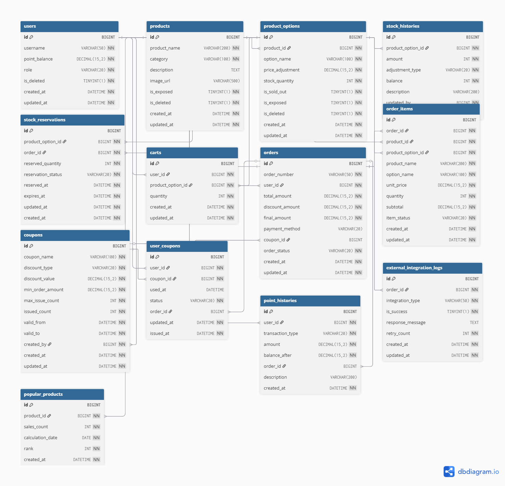

# Data Models

## 문서 정보
- **버전**: 1.1.0
- **작성일**: 2025-11-12
- **프로젝트명**: E-Commerce System
- **기준 문서**: requirements.md v1.0.0

---

## 개요

이 문서는 이커머스 시스템의 데이터 모델과 비즈니스 규칙을 정의합니다. 데이터베이스 스키마는 MySQL을 기반으로 설계되었으며, 상품 옵션 관리, 주문 상태 분리, 포인트 시스템, 외부 연동 로그 기능을 가집니다.

---

## 용어 사전

### 주문 관련 상태

#### order_status (주문 전체 상태)
- **PENDING**: 결제 대기 상태. 주문 생성 직후 재고가 예약된 상태
    - 전환 조건: 주문 생성 API 호출 성공 시
    - 유효 기간: 15분 (타임아웃 시 자동 CANCELLED)
- **PAID**: 결제 완료 상태. 포인트/쿠폰 차감 완료, 재고 확정 차감됨
    - 전환 조건: 결제 API 호출 성공 및 결제 승인 완료
- **CANCELLED**: 주문 취소 상태. 예약 재고 복원, 포인트/쿠폰 환원됨
    - 전환 조건: 고객의 명시적 취소 요청 또는 15분 타임아웃

#### item_status (주문 상품별 배송 상태)
- **PREPARING**: 상품 준비 중. 결제 완료 후 출고 전 단계
    - 전환 조건: 주문 상태가 PAID로 변경 시 자동 설정
- **SHIPPING**: 배송 중. 물류사에 인계 완료
    - 전환 조건: 관리자의 출고 처리 또는 물류 연동 시스템 응답
- **DELIVERED**: 배송 완료. 고객 수령 완료
    - 전환 조건: 물류사의 배송 완료 알림 또는 관리자의 수동 처리
- **CANCELLED**: 개별 상품 취소. 부분 취소 시 사용
    - 전환 조건: PREPARING 상태에서만 가능, 고객 요청 또는 재고 부족

### 재고 관련

- **physicalStock**: 물리적 재고 수량
- **reservedStock**: 예약된 재고 수량
- **availableStock**: 실제 판매 가능 재고 (physicalStock - reservedStock)

#### reservation_status (재고 예약 상태)
- **RESERVED**: 재고 예약 중. 주문 생성 시점부터 15분간 유지
- **CONFIRMED**: 재고 확정. 결제 완료 시 실제 재고에서 차감
- **RELEASED**: 예약 해제. 타임아웃 또는 주문 취소 시 재고 복원

### 금액 관련 용어

- **total_amount**: 주문 상품들의 정가 합계 (할인 전)
- **discount_amount**: 쿠폰으로 인한 할인 금액
- **final_amount**: 고객이 실제 결제해야 할 금액 (total_amount - discount_amount)

### 플래그 관련 용어

- **is_exposed**: 노출 여부
    - 1: 고객에게 노출 (목록/검색 결과에 표시)
    - 0: 비노출 (관리자만 조회 가능, 고객 화면에서 숨김)
- **is_sold_out**: 품절 여부
    - 1: 품절 (재고 없음, 주문 불가)
    - 0: 판매 중 (재고 있음, 주문 가능)
- **is_deleted**: 논리 삭제 여부
    - 1: 삭제됨 (DB에 존재하나 모든 API에서 제외)
    - 0: 활성 상태

### 결제 관련
- **payment_method**: 결제 수단
  - CREDIT(신용카드), CHECK(체크카드), CASH(현금), KAKAO(카카오페이)

---

## ERD (Entity Relationship Diagram)

### ERD 다이어그램

### ERD 코드

dbdiagram.io 코드 보기

Table users {
id BIGINT [pk, increment, note: '사용자 고유 ID']
username VARCHAR(50) [not null, unique, note: '사용자명']
point_balance DECIMAL(15,2) [not null, default: 0, note: '포인트 잔액']
role VARCHAR(20) [not null, default: 'CUSTOMER', note: '역할: CUSTOMER, ADMIN']
is_deleted TINYINT(1) [not null, default: 0, note: '삭제 여부 (논리 삭제)']
created_at DATETIME [not null, default: `CURRENT_TIMESTAMP`, note: '생성일시']
updated_at DATETIME [not null, default: `CURRENT_TIMESTAMP ON UPDATE CURRENT_TIMESTAMP`, note: '수정일시']

indexes {
(username, is_deleted)
(id, role, is_deleted)
}

note: '유저 정보'
}

Table products {
id BIGINT [pk, increment, note: '상품 고유 ID']
product_name VARCHAR(200) [not null, note: '상품명']
category VARCHAR(100) [not null, note: '카테고리']
description TEXT [note: '상품 설명']
price DECIMAL(15,2) [not null, note : '기본 상품 가격']
image_url VARCHAR(500) [note: '이미지 URL']
is_exposed TINYINT(1) [not null, default: 1, note: '상품목록 노출여부 (1: 노출, 0: 비노출)']
is_deleted TINYINT(1) [not null, default: 0, note: '삭제 여부 (논리 삭제)']
created_at DATETIME [not null, default: `CURRENT_TIMESTAMP`, note: '생성일시']
updated_at DATETIME [not null, default: `CURRENT_TIMESTAMP ON UPDATE CURRENT_TIMESTAMP`, note: '수정일시']

indexes {
(is_exposed, is_deleted, category)
(is_exposed, is_deleted, created_at)
}

note: '상품 기본 정보'
}

Table product_options {
id BIGINT [pk, increment, note: '상품 옵션 고유 ID']
product_id BIGINT [not null, ref: > products.id, note: '상품 ID']
option_name VARCHAR(100) [not null, note: '옵션명 (예: 사이즈-M, 색상-레드)']
price_adjustment DECIMAL(15,2) [not null, note: '옵션 조정 가격 (기본 상품 가격에서 조정되는 가격)']
stock_quantity INT [not null, default: 0, note: '재고 수량']
is_sold_out TINYINT(1) [not null, default: 0, note: '품절 여부 (1: 품절, 0: 판매중)']
is_exposed TINYINT(1) [not null, default: 1, note: '옵션 노출 여부 (1: 노출, 0: 비노출)']
is_deleted TINYINT(1) [not null, default: 0, note: '삭제 여부 (논리 삭제)']
created_at DATETIME [not null, default: `CURRENT_TIMESTAMP`, note: '생성일시']
updated_at DATETIME [not null, default: `CURRENT_TIMESTAMP ON UPDATE CURRENT_TIMESTAMP`, note: '수정일시']

indexes {
product_id
(product_id, is_sold_out, is_exposed, is_deleted)
created_at
}

note: '상품 옵션 및 옵션별 재고 관리'
}

Table stock_histories {
id BIGINT [pk, increment, note: '재고 이력 고유 ID']
product_option_id BIGINT [not null, ref: > product_options.id, note: '상품 옵션 ID']
amount INT [not null, note: '수량']
adjustment_type VARCHAR(20) [not null, note: '재고 조정 타입: ADD(추가), USE(사용)'] 
balance INT [not null, note: '총 수량']
description VARCHAR(200) [note: '설명']
updated_by BIGINT [not null, note: '수정자 (수정자ID 또는 SYSTEM)']
created_at DATETIME [not null, default: `CURRENT_TIMESTAMP`, note: '재고기록 생성 일시']

indexes {
(product_option_id, created_at)
(product_option_id, adjustment_type, created_at)
(product_option_id, updated_by, created_at)
created_at
}

note: '재고 이력 (옵션별)'
}

Table stock_reservations {
id BIGINT [pk, increment, note: '재고 예약 고유 ID']
product_option_id BIGINT [not null, ref: > product_options.id, note: '상품 옵션 ID']
order_id BIGINT [not null, ref: > orders.id, note: '주문 ID']
reserved_quantity INT [not null, note: '예약 수량']
reservation_status VARCHAR(20) [not null, default: 'RESERVED', note: '예약 상태: RESERVED(예약중), CONFIRMED(확정), RELEASED(해제)']
reserved_at DATETIME [not null, default: `CURRENT_TIMESTAMP`, note: '예약 시각']
expires_at DATETIME [not null, note: '예약 만료 시각 (reserved_at + 15분)']
updated_at DATETIME [not null, default: `CURRENT_TIMESTAMP ON UPDATE CURRENT_TIMESTAMP`, note: '수정일시']
created_at DATETIME [not null, default: `CURRENT_TIMESTAMP`, note: '예약 생성 일시']

indexes {
order_id
(product_option_id, reservation_status)
expires_at
}

note: '재고 예약 관리 (15분 타임아웃 정책)'
}

Table carts {
id BIGINT [pk, increment, note: '장바구니 고유 ID']
user_id BIGINT [not null, ref: > users.id, note: '사용자 ID']
product_option_id BIGINT [not null, ref: > product_options.id, note: '상품 옵션 ID']
quantity INT [not null, note: '수량']
created_at DATETIME [not null, default: `CURRENT_TIMESTAMP`, note: '생성일시']
updated_at DATETIME [not null, default: `CURRENT_TIMESTAMP ON UPDATE CURRENT_TIMESTAMP`, note: '수정일시']

indexes {
(user_id, product_option_id) [unique]
user_id
}

note: '장바구니'
}

Table orders {
id BIGINT [pk, increment, note: '주문 고유 ID']
order_number VARCHAR(50) [not null, unique, note: '주문번호']
user_id BIGINT [not null, ref: > users.id, note: '사용자 ID']
total_amount DECIMAL(15,2) [not null, note: '총 상품 금액']
discount_amount DECIMAL(15,2) [not null, default: 0, note: '할인 금액']
final_amount DECIMAL(15,2) [not null, note: '최종 결제 금액']
payment_method VARCHAR(20) [note: '결제 방법: CREDIT(신용카드), CHECK(체크카드), CASH(현금), KAKAO(카카오페이)']
coupon_id BIGINT [ref: > coupons.id, note: '사용한 쿠폰 ID']
order_status VARCHAR(20) [not null, default: 'PENDING', note: '주문 전체 상태: PENDING(결제대기), PAID(결제완료), CANCELLED(취소)']
created_at DATETIME [not null, default: `CURRENT_TIMESTAMP`, note: '주문 일시']
updated_at DATETIME [not null, default: `CURRENT_TIMESTAMP ON UPDATE CURRENT_TIMESTAMP`, note: '업데이트 일시']

indexes {
(user_id, order_status)
(user_id, created_at)
created_at
}

note: '주문 (전체 주문 상태 관리)'
}

Table order_items {
id BIGINT [pk, increment, note: '주문 상품 고유 ID']
order_id BIGINT [not null, ref: > orders.id, note: '주문 ID']
product_id BIGINT [not null, ref: > products.id, note: '상품 ID']
product_option_id BIGINT [not null, ref: > product_options.id, note: '상품 옵션 ID']
product_name VARCHAR(200) [not null, note: '주문 시점 상품명']
option_name VARCHAR(100) [not null, note: '주문 시점 옵션명']
unit_price DECIMAL(15,2) [not null, note: '주문 시점 단일 상품 가격 (상품가격+옵션조정가)']
quantity INT [not null, note: '주문 수량']
subtotal DECIMAL(15,2) [not null, note: '소계 (단일 상품 가격 × 수량)']
item_status VARCHAR(20) [not null, default: 'PREPARING', note: '상품별 상태: PREPARING(상품준비중), SHIPPING(배송중), DELIVERED(배송완료), CANCELLED(취소)']
created_at DATETIME [not null, default: `CURRENT_TIMESTAMP`, note: '생성일시']
updated_at DATETIME [not null, default: `CURRENT_TIMESTAMP ON UPDATE CURRENT_TIMESTAMP`, note: '수정일시']

indexes {
order_id
(order_id, item_status)
item_status
product_option_id
}

note: '주문 상품 상세 (개별 상품 상태 관리)'
}

Table coupons {
id BIGINT [pk, increment, note: '쿠폰 고유 ID']
coupon_name VARCHAR(100) [not null, note: '쿠폰명']
discount_type VARCHAR(20) [not null, note: '할인 타입: FIXED(정액), PERCENTAGE(정률)']
discount_value DECIMAL(15,2) [not null, note: '할인 금액 또는 할인 비율']
min_order_amount DECIMAL(15,2) [not null, default: 0, note: '최소 주문 금액']
max_issue_count INT [not null, note: '최대 발급 수량']
issued_count INT [not null, default: 0, note: '현재 발급된 수량']
valid_from DATETIME [not null, note: '유효기간 시작일']
valid_to DATETIME [not null, note: '유효기간 종료일']
created_by BIGINT [not null, ref: > users.id, note: '생성자 ID']
created_at DATETIME [not null, default: `CURRENT_TIMESTAMP`, note: '생성일시']
updated_at DATETIME [not null, default: `CURRENT_TIMESTAMP ON UPDATE CURRENT_TIMESTAMP`, note: '수정일시']

indexes {
(valid_from, valid_to)
created_at
}

note: '쿠폰 마스터'
}

Table user_coupons {
id BIGINT [pk, increment, note: '사용자 쿠폰 고유 ID']
user_id BIGINT [not null, ref: > users.id, note: '사용자 ID']
coupon_id BIGINT [not null, ref: > coupons.id, note: '쿠폰 ID']
used_at DATETIME [note: '사용일시']
status VARCHAR(20) [not null, note: '상태: ACTIVE(사용 가능), USED(사용됨), EXPIRED(만료됨)']
order_id BIGINT [ref: > orders.id, note: '사용한 주문 ID']
updated_at DATETIME [not null, default: `CURRENT_TIMESTAMP`, note: '업데이트 일시']
issued_at DATETIME [not null, default: `CURRENT_TIMESTAMP`, note: '발급일시']

indexes {
(user_id, coupon_id) [unique]
(user_id, status, issued_at)
coupon_id
(status, issued_at)
}

note: '사용자별 쿠폰 발급 및 사용 이력'
}

Table point_histories {
id BIGINT [pk, increment, note: '포인트 이력 고유 ID']
user_id BIGINT [not null, ref: > users.id, note: '사용자 ID']
transaction_type VARCHAR(20) [not null, note: '거래 타입: CHARGE(충전), USE(사용)']
amount DECIMAL(15,2) [not null, note: '거래 금액']
balance_after DECIMAL(15,2) [not null, note: '거래 후 포인트 잔액']
order_id BIGINT [ref: > orders.id, note: '연결된 주문 ID (사용 시)']
description VARCHAR(200) [note: '설명']
created_at DATETIME [not null, default: `CURRENT_TIMESTAMP`, note: '거래일시']

indexes {
(user_id, created_at)
created_at
(user_id, transaction_type, created_at)
}

note: '포인트 충전 및 사용 이력'
}

Table external_integration_logs {
id BIGINT [pk, increment, note: '로그 고유 ID']
order_id BIGINT [not null, ref: > orders.id, note: '주문 ID']
integration_type VARCHAR(50) [not null, note: '연동 시스템 타입: LOGISTICS(물류), SALES_MANAGEMENT(매출관리), ERP 등']
is_success TINYINT(1) [not null, default: 0, note: '성공 여부 (1: 성공, 0: 실패)']
response_message TEXT [note: '응답 메시지 또는 에러 메시지']
retry_count INT [not null, default: 0, note: '재시도 횟수']
created_at DATETIME [not null, default: `CURRENT_TIMESTAMP`, note: '최초 전송 시도 일시']
updated_at DATETIME [not null, default: `CURRENT_TIMESTAMP ON UPDATE CURRENT_TIMESTAMP`, note: '마지막 업데이트 일시']

indexes {
(order_id, created_at)
(integration_type, is_success, retry_count)
created_at
}

note: '외부 시스템 연동 로그 (물류, 매출관리 등)'
}

Table popular_products {
id BIGINT [pk, increment, note: '인기 상품 통계 고유 ID']
product_id BIGINT [not null, ref: > products.id, note: '상품 ID']
sales_count INT [not null, default: 0, note: '판매 수량']
calculation_date DATE [not null, note: '집계 기준일']
rank INT [not null, note: '순위']
created_at DATETIME [not null, default: `CURRENT_TIMESTAMP`, note: '생성일시']

indexes {
(calculation_date, rank) [unique]
product_id
calculation_date
}

note: '최근 3일간 인기 상품 통계 (배치로 집계)'
}

## 도메인 모델

### 핵심 도메인

#### 1. 사용자 (User Domain)
사용자 계정 관리와 포인트 잔액을 관리하는 도메인입니다.

**주요 엔티티**:
- `users`: 사용자 기본 정보 및 포인트 잔액
- `point_histories`: 포인트 충전 및 사용 이력

**비즈니스 규칙**:
- 포인트 잔액은 항상 0 이상이어야 함
- 포인트 충전 최소 금액: 1,000원
- 포인트 사용 시 보유 포인트보다 많이 사용할 수 없음

---

#### 2. 상품 (Product Domain)
상품 정보와 옵션별 재고를 관리하는 도메인입니다.

**주요 엔티티**:
- `products`: 상품 기본 정보
- `product_options`: 상품 옵션 및 옵션별 가격/재고
- `stock_histories`: 재고 조정 이력
- `stock_reservations`: 재고 예약

**비즈니스 규칙**:
- 상품은 하나 이상의 옵션을 가져야 함
- 상품의 품절 여부는 product_options의 is_sold_out로만 관리 (products 테이블에는 없음)
- 상품 전체 품절 여부 = 모든 옵션의 is_sold_out가 1인 경우
- 재고는 옵션 단위로 관리되며 음수가 될 수 없음
- `is_exposed`가 0인 상품은 목록에 노출되지 않음
- `is_sold_out`가 1인 옵션은 주문 불가
- 옵션은 `is_deleted`로 논리 삭제되며, 비노출(`is_exposed=0`)과 구분함
- 재고 조정 시 조정 사유와 조정자를 기록해야 함
- 주문 생성 시 재고는 '예약(RESERVED)' 상태로 전환되며, 즉시 차감하지 않음
- 예약된 재고는 15분 타임아웃 정책 적용:
  - 15분 내 결제 완료: 재고 확정 차감 (CONFIRMED)
  - 15분 내 미결제: 자동 예약 해제 및 재고 복원 (RELEASED)
  - 주문 취소: 즉시 예약 해제 및 재고 복원
- 실제 판매 가능 재고 = 물리적 재고 - 예약된 재고(RESERVED)

---

#### 3. 장바구니 (Cart Domain)
사용자별 장바구니를 관리하는 도메인입니다.

**주요 엔티티**:
- `carts`: 사용자별 장바구니 아이템

**비즈니스 규칙**:
- 장바구니는 사용자와 상품 옵션의 조합으로 유니크함
- 동일 옵션 추가 시 수량이 합산됨
- 수량은 1 이상이어야 함
- 장바구니 조회 시 실시간 가격 및 재고 상태를 확인해야 함

---

#### 4. 주문 (Order Domain)
주문 생성, 결제, 배송 상태를 관리하는 도메인입니다.

**주요 엔티티**:
- `orders`: 주문 기본 정보 및 전체 주문 상태
- `order_items`: 주문 상품 상세 및 개별 상품 배송 상태

**비즈니스 규칙**:
- 주문 상태: `PENDING` → `PAID` → (각 아이템별 상태 진행)
- 주문 아이템 상태: `PREPARING` → `SHIPPING` → `DELIVERED`
- 하나의 주문 내에서 각 상품은 독립적인 배송 상태를 가질 수 있음
- 주문 생성 시 재고 예약 처리 (즉시 차감 X)
- 재고 예약 실패 시 주문 생성 불가
- 결제 완료(PAID) 시점에 예약된 재고 확정 차감
- 15분 내 미결제 주문은 자동 취소(CANCELLED)되며 예약 재고 자동 복원
- 고객의 명시적 주문 취소 시에도 예약 재고 즉시 복원
- 결제 완료 시 재고 차감 및 포인트 차감 처리
- 쿠폰은 주문당 하나만 적용 가능

**주문 상태 전이**:
- 주문 상태: PENDING → PAID → (각 아이템별 상태 진행)
- 주문 상태: PENDING → CANCELLED
- 주문 아이템 상태: PREPARING → SHIPPING → DELIVERED
- 주문 아이템 상태: PREPARING → CANCELLED

#### 5. 쿠폰 (Coupon Domain)
쿠폰 발급 및 사용을 관리하는 도메인입니다.

**주요 엔티티**:
- `coupons`: 쿠폰 마스터 정보
- `user_coupons`: 사용자별 쿠폰 발급 및 사용 이력 (status=ACTIVE, USED, EXPIRED)

**비즈니스 규칙**:
- 선착순 발급 시 `max_issue_count`를 초과할 수 없음
- 쿠폰은 사용자당 한 번만 발급 가능
- 유효기간 내에만 사용 가능
- 최소 주문 금액을 충족해야 사용 가능
- 정액 할인: 고정 금액 차감
- 정률 할인: 주문 금액의 비율만큼 차감
- 사용된 쿠폰은 재사용 불가

**엔티티 관계**:
- Coupon 1 : N UserCoupon (하나의 쿠폰은 여러 사용자에게 발급)
- User 1 : N UserCoupon (한 사용자는 여러 쿠폰을 보유)
- UserCoupon N : 1 Order (사용된 쿠폰은 주문과 연결)

---

#### 6. 포인트 (Point Domain)
사용자 포인트 충전 및 사용을 관리하는 도메인입니다.

**주요 엔티티**:
- `users.point_balance`: 현재 포인트 잔액
- `point_histories`: 포인트 거래 이력

**비즈니스 규칙**:
- 충전 최소 금액: 1,000원
- 포인트는 음수가 될 수 없음
- 모든 거래는 이력에 기록되어야 함
- 거래 후 잔액이 `point_histories`에 스냅샷으로 저장됨

**트랜잭션 타입**:
- `CHARGE`: 포인트 충전
- `USE`: 주문 결제 시 포인트 사용

---

#### 7. 외부 연동 (External Integration Domain)
외부 시스템과의 데이터 연동 로그를 관리하는 도메인입니다.

**주요 엔티티**:
- `external_integration_logs`: 외부 시스템 연동 로그

**비즈니스 규칙**:
- 주문 완료 시 자동으로 외부 시스템에 데이터 전송
- 전송 실패 시 최대 5회까지 재시도
- 재시도 간격: 1분, 5분, 15분, 30분, 60분
- 모든 전송 시도는 로그에 기록

**연동 시스템 타입**:
- `LOGISTICS`: 물류 시스템
- `SALES_MANAGEMENT`: 매출 관리 시스템
- `ERP`: 전사적 자원 관리 시스템

---

#### 8. 통계 (Statistics Domain)
인기 상품 통계를 관리하는 도메인입니다.

**주요 엔티티**:
- `popular_products`: 인기 상품 순위

**비즈니스 규칙**:
- 최근 3일간 판매량 기준으로 집계
- Top 5 순위만 저장
- 배치 작업으로 일 1회 집계
- 판매량이 동일한 경우 최근 주문된 상품이 우선

---

## 테이블 간 관계 설명

- **products ↔ product_options (1:N)**
    - 하나의 상품(products)은 여러 개의 옵션(product_options)을 가질 수 있습니다.
    - 상품이 삭제 또는 수정될 경우 관련 옵션들도 함께 영향을 받습니다 (CASCADE).

- **product_options ↔ stock_histories (1:N)**
    - 하나의 옵션(product_options)은 여러 개의 재고 변동 이력(stock_histories)을 가질 수 있습니다.
    - 옵션이 삭제될 경우 관련 재고 이력 역시 모두 삭제됩니다 (CASCADE).

- **users ↔ carts (1:N)**
    - 한 명의 사용자(users)는 여러 장바구니 항목(carts)을 가질 수 있습니다.
    - 사용자가 삭제될 경우 해당 사용자와 연결된 장바구니 기록도 함께 삭제됩니다 (CASCADE).

- **product_options ↔ carts (1:N)**
    - 하나의 옵션(product_options)은 여러 장바구니(carts)에 담길 수 있습니다.
    - 옵션이 삭제될 경우 해당 옵션이 포함된 장바구니 기록도 함께 삭제됩니다 (CASCADE).

- **users ↔ orders (1:N)**
    - 한 명의 사용자(users)는 여러 건의 주문(orders)을 만들 수 있습니다.

- **coupons ↔ orders (1:N)**
    - 하나의 쿠폰(coupons)은 여러 주문(orders)에서 사용될 수 있습니다.
    - 주문은 쿠폰을 참조할 수 있습니다.

- **orders ↔ order_items (1:N)**
    - 하나의 주문(orders)은 여러 개의 주문 상품(order_items)을 가집니다.
    - 주문이 삭제될 경우 해당 주문에 속한 주문 상품도 함께 삭제됩니다 (CASCADE).

- **products ↔ order_items (1:N)**
    - 하나의 상품(products)은 여러 주문 상품(order_items)과 연결될 수 있습니다.

- **product_options ↔ order_items (1:N)**
    - 하나의 옵션(product_options)은 여러 주문 상품(order_items)과 연결될 수 있습니다.

- **users ↔ user_coupons (1:N)**
    - 한 명의 사용자(users)는 여러 개의 사용자별 쿠폰(user_coupons)을 가질 수 있습니다.
    - 사용자가 삭제되면 해당 사용자와 연결된 쿠폰 기록도 함께 삭제됩니다 (CASCADE).

- **coupons ↔ user_coupons (1:N)**
    - 하나의 쿠폰(coupons)은 여러 사용자의 쿠폰 기록(user_coupons)에 연결됩니다.

- **orders ↔ user_coupons (1:N)**
    - 하나의 주문(orders)은 사용자 쿠폰(user_coupons) 기록과 연결될 수 있습니다.

- **users ↔ point_histories (1:N)**
    - 한 명의 사용자(users)는 여러 개의 포인트 거래 이력(point_histories)을 가질 수 있습니다.
    - 사용자가 삭제되면 관련 포인트 이력도 함께 삭제됩니다 (CASCADE).

- **orders ↔ point_histories (1:N)**
    - 하나의 주문(orders)은 여러 포인트 거래 기록(point_histories)과 연결될 수 있습니다.

- **orders ↔ external_integration_logs (1:N)**
    - 하나의 주문(orders)은 여러 외부 연동 로그(external_integration_logs)와 연결될 수 있습니다.

- **products ↔ popular_products (1:N)**
    - 하나의 상품(products)은 여러 인기 상품 통계(popular_products)와 연결될 수 있습니다.

---

## 인덱스 전략

### 성능 최적화를 위한 주요 인덱스

#### 조회 성능
- `products(is_exposed, is_deleted, category)` 또는 `(is_exposed, is_deleted, created_at)`: 노출/정렬 최적화
- `product_options(product_id, is_sold_out, is_exposed, is_deleted)`: 판매 가능 옵션 필터링
- `orders(user_id, order_status)` 및 `(user_id, created_at)`: 사용자 주문 조회/최근순
- `order_items(order_id, item_status)`: 주문 상세 상태 조회
- `stock_histories(product_option_id, created_at)`: 옵션별 재고 이력 타임라인
- `stock_reservations(product_option_id, reservation_status)` 및 `expires_at`: 만료 스캔/확정 처리

#### 중복 방지
- `carts(user_id, product_option_id) UNIQUE`: 장바구니 중복 추가 방지
- `user_coupons(user_id, coupon_id) UNIQUE`: 쿠폰 중복 발급 방지

#### 외부 연동
- `external_integration_logs(order_id, created_at)`: 주문별 연동 이력 시간순 조회
- `external_integration_logs(integration_type, is_success, retry_count)`: 실패 재시도 대상 조회

---

## 설계 변경 보고서

### 변경 일시
2025-11-12

### 주요 변경 사항

#### 1. 쿠폰 상태 관리 개선

**변경 내용**
- `user_coupons` 테이블의 `is_used` 필드(boolean) → `status` 필드(VARCHAR)로 변경
- 상태 값: `ACTIVE` (사용 가능), `USED` (사용됨), `EXPIRED` (만료됨)

**변경 이유**
- **명확한 상태 구분**: boolean 타입으로는 "사용 전", "사용 완료" 두 가지 상태만 표현 가능했으나, "만료됨" 상태가 필요
- **비즈니스 로직 개선**: 쿠폰 유효기간이 지났을 때 명시적으로 `EXPIRED` 상태로 관리 가능
- **확장성**: 향후 다른 상태(예: REVOKED, PENDING 등) 추가 시 유연하게 대응 가능
- **데이터 무결성**: 사용 여부와 만료 여부를 별도로 관리하여 더 정확한 쿠폰 이력 추적

**영향 범위**
- DB 스키마: `user_coupons.status` 컬럼 추가, 기존 `is_used` 데이터 마이그레이션 필요
- 도메인 모델: `UserCoupon` 클래스에 `UserCouponStatus` enum 추가
- API 응답: `UserCouponResponse`에 `status` 필드 포함

---

#### 2. 재고 예약 시스템 도입

**변경 내용**
- 새로운 테이블 `stock_reservations` 추가
- 재고 개념 세분화:
  - `physicalStock`: 물리적 재고 수량 (product_options.stock_quantity)
  - `reservedStock`: 예약된 재고 수량 (stock_reservations 합계)
  - `availableStock`: 실제 판매 가능 재고 (physicalStock - reservedStock)
- 예약 상태: `RESERVED` (예약중), `CONFIRMED` (확정), `RELEASED` (해제)
- 15분 타임아웃 정책 적용

**변경 이유**
- **동시성 문제 해결**: 주문 생성과 결제 사이의 시간차로 인한 재고 관리 문제 해결
- **재고 정확성 향상**: 결제 전 단계에서 재고를 예약하여 이중 판매 방지
- **사용자 경험 개선**: 장바구니에 담은 상품이 결제 전에 품절되는 것을 방지
- **재고 회전율 최적화**: 15분 타임아웃으로 미결제 주문의 재고를 자동 복원
- **비즈니스 유연성**: 주문 취소, 결제 실패 등의 상황에서 재고를 자동으로 복원

**영향 범위**
- DB 스키마: `stock_reservations` 테이블 신규 추가
- 도메인 모델: `StockReservation` 클래스, `ReservationStatus` enum 추가
- 주문 프로세스: 주문 생성 → 재고 예약 → 결제 → 재고 확정 플로우 적용
- 배치 작업: 만료된 예약 정리 배치 작업 필요
- API: `/api/stock/reserve`, `/api/stock/reserve/{id}/confirm`, `/api/stock/reserve/{id}/release` 엔드포인트 추가

---

#### 3. 주문 상태 분리

**변경 내용**
- `orders` 테이블: `order_status` (주문 전체 상태)
  - `PENDING`: 결제 대기
  - `PAID`: 결제 완료
  - `CANCELLED`: 주문 취소
- `order_items` 테이블: `item_status` (개별 상품 배송 상태)
  - `PREPARING`: 상품 준비 중
  - `SHIPPING`: 배송 중
  - `DELIVERED`: 배송 완료
  - `CANCELLED`: 개별 상품 취소

**변경 이유**
- **세밀한 상태 관리**: 주문 전체 상태와 개별 상품의 배송 상태를 독립적으로 관리
- **부분 배송 지원**: 하나의 주문 내에서 상품별로 다른 배송 상태를 가질 수 있음
- **고객 편의성**: 주문 내 일부 상품만 취소하거나 환불하는 케이스 처리 가능
- **물류 효율성**: 상품별 출고 시점이 다를 때 유연한 처리
- **확장성**: 향후 부분 환불, 교환 등의 비즈니스 로직 구현 용이

**영향 범위**
- DB 스키마: `orders.order_status`, `order_items.item_status` 컬럼 의미 명확화
- 도메인 모델: `OrderStatus`, `OrderItemStatus` enum 분리
- API: 주문 상태 변경 API와 주문 아이템 상태 변경 API 분리
- 비즈니스 로직: 주문 취소 시 재고 복원 로직, 부분 취소 로직 추가

---

#### 4. 결제 수단 추적

**변경 내용**
- `orders` 테이블에 `payment_method` 필드 추가
- 결제 수단: `CREDIT` (신용카드), `CHECK` (체크카드), `CASH` (현금), `KAKAO` (카카오페이)

**변경 이유**
- **결제 분석**: 결제 수단별 매출 분석 가능
- **정산 처리**: 결제 수단에 따른 수수료 계산 및 정산 처리
- **고객 편의**: 선호 결제 수단 분석 및 맞춤형 프로모션 가능
- **감사 추적**: 결제 이력 추적 및 분쟁 해결 시 참고 자료

**영향 범위**
- DB 스키마: `orders.payment_method` 컬럼 추가
- API: 결제 요청 시 `paymentMethod` 파라미터 필수
- 도메인 모델: `PaymentMethod` enum 또는 상수 추가
- 리포팅: 결제 수단별 매출 리포트 추가

---

### 호환성 

#### API 호환성
- 기존 API 응답에 변경 필드 수정, 새로운 필드 추가 (하위 호환)
- 쿠폰 API: `isUsed` 필드 -> `status` 필드 변경
- 재고 API: 새로운 예약 관련 엔드포인트 추가

---
